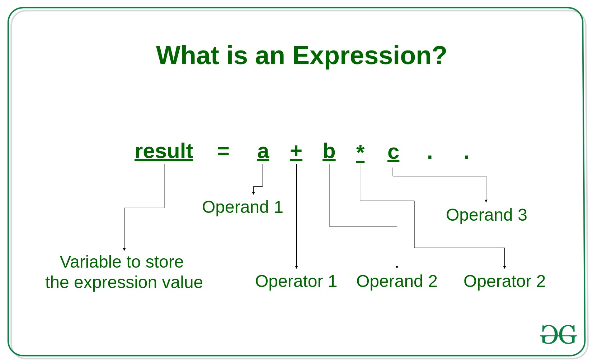

# SICP

# Building Abstractions with Procedures

## The Elements of Programming

Güçlü her programlama dilinde bulunanlar: 

- **primitive expressions**: en temeldeki işlemler (toplama, çıkarma, çarpma…)
- **means of combination**: daha basit elementleri birleştirebilme
- **means of abstraction**: bileşik elemanlara isim takma ve bunları manipüle edebilme

### Expressions

sen bir expression yazarsın, interpreter (yorumlayıcı) da bunu hesaplar (evaluating). 

```scheme
486
;486

(+ 137 349)
;486

(- 1000 334)
;666

(* 5 99)
;495

(/ 10 5)
;2

(+ 2.7 10)
;12.7

(+ 21 35 12 7)
;75

(* 25 4 12)
;1200
```

Scheme, **prefix** yapılı bir dil. O yüzden en solda her zaman **operator** bulunuyor ve neleri işleyeceği (**operand**) sağına yazılır. Operandların değerlerine de **argümanlar** denir. Prefix olmasının bir başka artısı da iç içe (nested) ifadelerin kombinasyonlarını yapmayı kolaylaştırması.



```scheme
(+ (* 3 5) (- 10 6))
;19

(+ (* 3 (+ (* 2 4) (+ 3 5))) (+ (- 10 7) 6))

; daha güzel yazılmışı 
(+ (* 3
      (+ (* 2 4)
         (+ 3 5)))
   (+ (- 10 7)
      6))
```

### Naming and the Environment

18 sayısı tek başına bir anlam ifade etmez. Bu 18 yaş olduğunda anlam kazanır. Bunun programlama dilindeki karşılığı da soyutlamadır (abstraction). Böylelikle değeri (value) bir değişkene (variable) atarız.

Bu atama işlemi sonucunda bilgi hafızada isim-nesne (name-object) şeklinde tutulur. Bu bilgiyi tutan hafızaya çevre (environment) denir. 

```scheme
(define size 2)
size
;2

(* 5 size)
;10

(define pi 3.14159)
(define radius 10)

(* pi (* radius radius))
314.159

(define circumference (* 2 pi radius))

circumference
62.8318
```

### Evaluating Combinations

Matematikteki işlem sırası gibi programlamada da ifadeleri (expression) hesaplama kuralı, sırası (evaluation rule) vardır. Bu kural yapısı gereğince özyinelemelidir (recursive, daha sonra detayı gelecek). 

 

```scheme
(* (+ 2 (* 4 6)) (+ 3 5 7))

```


### Compound Procedures

Bilgisayar temelde hiçbir şeyi bilmez, onun bir şey yapmasını istiyorsak adım adım neler yapması gerektiğini söylememiz gerekir. Tüm adımları ona anlatma işlemi Prosedür tanımlamaları (procedure definitions) olarak adlandırılır. 

Bunu matematikteki fonksiyona benzetebiliriz çünkü oradan geliyor. 

$$
f(x) = 4x^2+2x+7
$$

 fonksiyonu bize şunu söyler: 

- Verilen sayının karesini al, 4 ile çarp, sonra bu sonucu verilen sayının 2 katıyla topla, ardından çıkan sonucu 7 ekleyerek son değeri bul.

Lisp programlama dilinde bunu şöyle yapıyoruz ve buna bileşik prosedür (compound procedure) deniyor. 

```scheme
(define (square x) (* x x))
; bir şeyin karesini almak için, sayıyı kendisi ile çarp 
```

Genel yapısı 

`(define (<prosedür_ismi> <gerekli_parametreler>) <işlemleri_yazdığımız_kısım>)`

```scheme
(define (square x) (* x x))

(square 21)
;441

(square (+ 2 5))
;49

(square (square 3))
;81

; kare almayı öğrendik şimdi x^2+y^2 gibi bir işlem yapan prosedürü yazalım

(define (sum-of-squares x y)
	(+ (square x) (square y)))
	
(sum-of-squares 3 4)
;25

; bu fonksiyonu başka bir fonksiyon altında kullanalım

; bu fonksiyon verilen sayının bir fazlasının karesi ile verilen sayının iki katının karesini topluyor 

(define (f a)
  (sum-of-squares (+ a 1) (* a 2)))

(f 5) ; 6^2 + 10^2  = 36 + 100 = 136
136
```

### Substitution Model for Procedure Application

Substitution, yerine koyma anlamına geliyor. Burada değişkenler, ifadelerin sonuçlarına yerlerine tek tek konarak ilerlenir. Örnek ile bakalım: 

 

```scheme
(define (square x) (* x x))

(define (sum-of-squares x y)
	(+ (square x) (square y)))

(define (f a)
  (sum-of-squares (+ a 1) (* a 2)))
 
(f 5) ; yukarıdaki fonksiyona 5 değerini verdik
; (sum-of-squares (+a 1) (* a 2))
; (sum-of-squares (+5 1) (* 5 2))
; (sum-of-squares 6 10)
; sum-of-square prosedürü içindeki square prosedürüne geçtik 
; (+ (square 6) (square 10))
; şimdi de square fonksiyonuna geçtik
; (square 6) -> (* 6 6)     (square 10) -> (* 10 10)
; (+ 36 100)
; (136)

```

Makineler de bu şekilde adım adım çalışır, (applicative-order evaluation). Bir prosedürün nasıl çalıştığını, ne sonuç ürettiğini analiz etmek için kullanabileceğimiz yöntemlerden biridir. 

Bir başka hesaplama yönteminde de tüm değerler yerine konulana kadar herhangi bir hesaplama yapmaz (normal-order evaluation)

```scheme
(sum-of-squares (+ 5 1) (* 5 2))

(+ (square (+ 5 1)) 
   (square (* 5 2)))

(+ (* (+ 5 1) (+ 5 1)) 
   (* (* 5 2) (* 5 2)))
   
 ; tüm değerler yerine konuldu şimdi operatörler çalışacka
 (+ (* 6 6) 
   (* 10 10))

(+ 36 100)

136
```

### Conditional Expressions and Predicates

Hepimiz şöyle bir fonksiyona alışkınızdır. Bu mutlak değer fonksiyonu. “eğer ki sayı 0’dan küçükse eksi ile çarp, eğer 0’a eşit ise 0 yaz, 0’dan büyük ise olduğu gibi yaz.” anlamına gelmektedir. Bu “eğer” koşulunun programlamadaki karşılığı da koşul ifadeleridir (conditional expressions)


```scheme
(define (abs x)
  (cond ((> x 0) x)
        ((= x 0) 0)
        ((< x 0) (- x))))
```

```
Genel kural:

(cond (⟨p₁⟩ ⟨e₁⟩)
      (⟨p₂⟩ ⟨e₂⟩)
      …
      (⟨pₙ⟩ ⟨eₙ⟩))
      
Buradaki p'ler predicateler. Burada olmasını beklediğimiz koşulları belirtiyoruz, e ise bu koşullar sağlandığında gerçekleştirilecek işlemler, ikisinin de bulunduğu paranteze de clause denir.
```

```scheme
; mutlak değeri yazmanın farklı bir yöntemi. 
(define (abs x)
  (cond ((< x 0) (- x)) ; sayı 0'dan küçükse eksi ile çarp
        (else x)))      ; "diğer durumlarda" olduğu gibi yaz
        
; daha güzel yazımı 
(define (abs x)
  (if (< x 0)
      (- x)
      x))
```

Buradaki küçüktür, büyüktür, eşittir ifadelerinin yanısıra AND, OR, NOT gibi mantıksal işlemler de kullanılabilir.

```lisp
"""Exercise 1.1: Below is a sequence of expressions. What is
the result printed by the interpreter in response to each expression?
Assume that the sequence is to be evaluated in
the order in which it is presented."""
10 ; 10
(+ 5 3 4) ; 12
(- 9 1) ; 8
(/ 6 2) ; 3
(+ (* 2 4) (- 4 6)) ; 6
(define a 3) ; a = 3
(define b (+ a 1)) ; b = 4
(+ a b (* a b)) ; 19
(= a b) ; False

(if (and (> b a) (< b (* a b))) ;4>3 ve 4<12 ise True
		b  ; True olduğun için sonuç 4  
		a) ; False durumu
		
(cond ((= a 4) 6) ; False
			((= b 4) (+ 6 7 a)) ;16
			(else 25)) ; yukarıdaki kod çalıştığı için burası çalışmayacak
		
(+ 2 (if (> b a) b a)) ;6

(* (cond ((> a b) a)
		((< a b) b) ;4
		(else -1))
	(+ a 1))
	; (* 4 5) = 20
```

### Example: Square Roots by Newton’s Method

Newton bir sayının karekökünü hesaplamanın bir yöntemini bulmuş. Bu yöntem şu şekilde çalışıyor:

$$
\sqrt{x} = y, y\geq 0 ,  y^2=x
$$

yani y sayısı sıfırdan farklı ise, iki tarafın da karesini alarak x’in karekökünden kurtulabiliriz. 

```scheme
(define (sqrt x)
  (the y (and (>= y 0)  ; y sıfırdan büyük veya eşit ise
              (= (square y) x)))) ; y'nin karesi x'e eşittir
```

Bu bizim kullandığımız ve bildiğimiz bir şey fakat bunu uygulayabilmek için hem x hem de y değerini bilmemiz gerekiyor. Peki ya yalnızca √***2*** gibi hesaplanmayı bekleyen bir sayımız olsaydı ne yapacaktık? 


Bu işlemleri tekrarlayacaktık. Bu işlem ne yapıyor. 

- Öncelikle kök 2’nin sonucunun 1 olduğunu tahmin ediyor
- içerideki sayıyı (bu örnek için 2) tahminimize bölüyor ve böylelikle bölüm katsayısı elde ediliyor.
- son olarak da bölüm katsayısı ile tahminimizi toplayıp ikiye bölüyoruz yani ortalamasını alıyoruz.
- ortalamada çıkan değerimiz bizim yeni tahminimiz oluyor ve bu süreç sayının kareköküne “yeterince yakın olana kadar” devam ediyor.
    - Burada sonuç 1.4142 çıkmış ve bu da doğru sonuca ulaştık demek oluyor.

Bu prosedürün taslağını çıkaracak olursak:

```scheme
(define (sqrt-iter guess x)
  (if (good-enough? guess x) ; yeterince yakın mı?
      guess ; EVET ise, tahminimiz doğru cevap demektir.  
      (sqrt-iter (improve guess x) x))) ; HAYIR ise, tahminimizi geliştirip tekrardan prosedüre o sayı ile baştan başlıyoruz
```

Buradaki improve yani tahmini geliştirme kısmı formüldeki average yani ortalama kısmına karşılık geliyor 

```scheme
(define (improve guess x)
  (average guess (/ x guess)))
  
;(define (average x y) 
;  (/ (+ x y) 2))
```

good-enough? yani yeterince iyi mi değil mi kontrolü ise biraz bize kalmış. Biz gerçek hesaplamayı bilgisayarın kendi prosedürüne yaptırıp kendi tahminimizle karşılaştıracağız. Eğer ki aradaki fark binde 1’den azsa bu bizim için yeterli demektir. 

```scheme
(define (good-enough? guess x)
  (< (abs (- (square guess) x)) 0.001)) ;abs: mutlak değer (absolute)
```

İlk tahminimizde 1 vermiştik onu da ekleyip prosedürü toparlayalım 

```scheme
(define (sqrt x)
  (sqrt-iter 1.0 x))
  
(define (improve guess x)
  (average guess (/ x guess))) 
  
(define (good-enough? guess x)
  (< (abs (- (square guess) x)) 0.001)) 
  
  (define (sqrt-iter guess x)
  (if (good-enough? guess x) 
      guess   
      (sqrt-iter (improve guess x) x)))
      
      
(sqrt 9)
;3.00009155413138

(sqrt (+ 100 37))
;11.704699917758145

(sqrt (+ (sqrt 2) (sqrt 3)))
;1.7739279023207892

(square (sqrt 1000))
;1000.000369924366
```

### Procedures as Black-box Abstractions


Sqrt bizim ilk prosedürlerimizden biri, gördüğümüz üzere de sqrt-iter prosedürü özyinelemeli (recursive) bir prosedür.

KELİMELER

subproblems

black-box 

how?

procedural abstraction

ÖZET

Burada problem altproblemlere ayrılıyor; tahmin yeterince iyi mi (good-enough), tahmini nasıl daha da geliştirebiliriz (improve). Her bir altproblem ayrı bir prosedür gerektiriyor. 

Biz square altında good-enough? prosedürünü tanımladığımızda square prosedürü bizim için bir kara kutu (black-box) haline gelecek. Bu andan itibaren prosedürün sonucu nasıl hesapladığını değil yalnızca square’ı hesapladığı gerçeği ile ilgileniriz. Bunun nasıl hesaplandığıyla ilgilenmeyiz. 

Burada square bir prosedür olarak düşünülmez, prosedürün soyutlanması, hayal edilmesi olarak tanımlanır. Bu duruma da prosedürel soyutlama (procedural abstraction) denir. 

```lisp
(define (square x) (* x x))
(define (square x) (exp (double (log x))))
(define (double x) (+ x x))

```

YEREL İSİMLER - LOCAL NAMES 

Prosedürün işlemleri, isminden bağımsızdır. Fakat prosedür içerisinde geçen başka prosedür isimleri yerel olarak hafızada yer almalıdır. Bizim kullandığımız abs, +, -, define gibi ifadelerin özellikle tanımlanmasına gerek yoktur zaten dilin içerisinde varsayılan olarak gelmektedirler. 

```lisp
(define (good-enough? guess x )
		(< (abs (- (square guess) x))
				0.001))
```

DAHİLİ TANIMLAR VE BLOK YAPISI - INTERNAL DEFINITIONS AND BLOCK STRUCTURE

```lisp
(define (sqrt x)
		(sqrt-iter 1.0 x))
		
(define (sqrt-iter guess x)
		(if (good-enough? guess x)
		guess
		(sqrt-iter (improve guess x) x)))
		
(define (good-enough? guess x)
		(< (abs (- (square guess) x)) 0.001))

(define (improve guess x)
		(average guess (/ x guess)))
```

Kullanıcı açısından önem arz eden prosedür square. Prosedürü alt prosedürlere ayırmak yerine tamamını tek bir sqrt prosedürü altında yazabilirdik, bunu nested yapıya da blok yapısı (block structure) denir.

```lisp
(define (sqrt x)
		(define (good-enough? guess x)
				(< (abs (- (square guess) x)) 0.001))
		(define (improve guess x) (average guess (/ x guess)))
		(define (sqrt-iter guess x)
				(if (good-enough? guess x)
						guess
						(sqrt-iter (improve guess x) x)))
		(sqrt-iter 1.0 x))
```

Bunu daha da basitleştirebiliriz. Tüm prosedürler sqrt’in alt prosedürü olduğuna göre x değişkeni de hepsi için geçerli dahili bir değişken. X’i dahili tanımlamada serbest değişken (free variable) olarak kullanabiliriz. Böylelikle her alt prosedürde bunu tekrardan tanımlamamıza gerek kalmaz. Bu duruma da *lexical scoping* denir.
